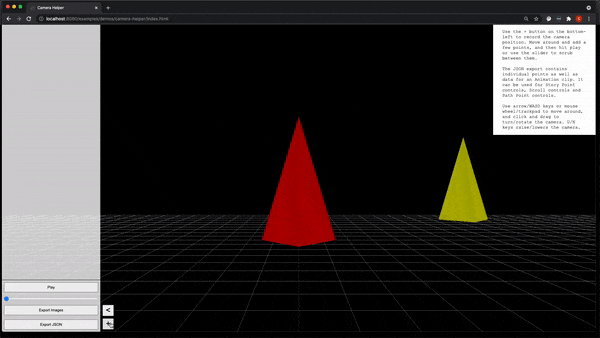

<div align="center">
  <h1>Three Story Controls</h1>
  
  <h2> A three.js camera toolkit for creating interactive 3d stories. </h2>
  <p>
    • Flexible camera rig API <br>
    • Visual tool for designing camera animations <br>
    • Collection of camera control schemes <br>
    • Helper components to wire smoothed inputs to camera actions for custom control schemes.
    <br><br>
  </p>
  
  <a href="https://cloud.drone.io/nytimes/three-story-controls"></a>
  <br/><br/>
    <a href="#demos">Demos</a> &mdash;
    <a href="#usage">Usage</a> &mdash;
    <a href="#installation">Installation</a> &mdash;
    <a href="https://nytimes.github.io/three-story-controls/docs/three-story-controls.html">API Docs</a> &mdash; 
    <a href="#contributing">Contributing</a> 
    <br><br>
    Components: <br>
    <a href="#camera-rig">Camera Rig</a> &mdash;
    <a href="#camera-helper">Camera Helper</a> &mdash;
    <a href="#control-schemes">Control Schemes</a> &mdash;
    <a href="#input-adaptors">Input Adaptors</a> 
    <br>
    <a href="#building-your-own-control-scheme">Building your own control scheme</a> <br><br>
</div>


---

<br>

## Demos
* [FreeMovement controls](https://nytimes.github.io/three-story-controls/examples/demos/freemove): First-person controls to move freely around the scene.
* [Scroll + 3DOF controls](https://nytimes.github.io/three-story-controls/examples/demos/scroll-controls): Scroll through the page to scrub through a camera animation. Slightly rotate the camera with mouse movements. 
* [StoryPoint + 3DOF controls](https://nytimes.github.io/three-story-controls/examples/demos/story-points): Transition between specific points in the scene. Slightly rotate the camera with mouse movements. 
* [PathPoint controls](https://nytimes.github.io/three-story-controls/examples/demos/path-points): Transition between specific frames of a camera animation.
* [Camera Helper](https://nytimes.github.io/three-story-controls/examples/demos/camera-helper): Helper tool to create camera animations and/or points of interest that can be exported and used by the control schemes.

<br> 

---

<br>

## Usage
Here is an example of the `FreeMovementControls` scheme, where camera translation is controlled by arrow keys or the mouse wheel, and rotation by clicking and dragging the mouse.

```javascript
import { Scene, PerspectiveCamera, WebGLRenderer, GridHelper } from 'three'
import { CameraRig, FreeMovementControls } from 'three-story-controls'

const scene = new Scene()
const camera = new PerspectiveCamera()
const renderer = new WebGLRenderer()
renderer.setSize(window.innerWidth, window.innerHeight)
document.body.appendChild(renderer.domElement)

const rig = new CameraRig(camera, scene)
const controls = new FreeMovementControls(rig)
controls.enable()

function render(t) {
  window.requestAnimationFrame(render)
  controls.update(t)
  renderer.render(scene, camera)
}

render()
```

<br>

---

<br>

## Installation

The library depends on [three.js](https://threejs.org/) r129 or later and [gsap](https://greensock.com/gsap/) 3.6.1, which need to be installed separately. 

### 1. ES Module
Download [`dist/three-story-controls.esm.min.js`](dist/three-story-controls.esm.min.js) (or use the [CDN link](https://unpkg.com/three-story-controls@latest/dist/three-story-controls.esm.min.js)) and use an `importmap-shim` to import the dependencies. See [here](examples/installation/es-module) for a full example. The [demos](examples/demos) also use this method of installation:
  
  #### **`index.html`**
  ```html
  <script async src="https://unpkg.com/es-module-shims@0.11.1/dist/es-module-shims.js"></script>
  <script type="importmap-shim">
  {
    "imports": {
      "three": "https://cdn.skypack.dev/three@0.137.0",
      "gsap": "https://cdn.skypack.dev/gsap@3.6.1",
      "three-story-controls" : "./three-story-controls.esm.min.js"
    }
  }
  </script>
  <script src='index.js' type='module-shim'></script>
  ```

  #### **`index.js`**
  ```javascript
  import { Scene, PerspectiveCamera } from 'three'
  import { ScrollControls } from 'three-story-controls'
  ```

### 2. NPM
If you use a build system such as Webpack / Parcel / Rollup etc, you can also install the library along with three.js and gsap from [npm](https://www.npmjs.com/package/three-story-controls):
```
npm install -s three gsap three-story-controls
```
See [here](examples/installation/webpack) for a webpack example.

### 3. Script tag
Download [`dist/three-story-controls.min.js`](dist/three-story-controls.min.js) (or use the [CDN link](https://unpkg.com/three-story-controls@latest/dist/three-story-controls.min.js)) and include it in your HTML file with a script tag, along with three.js and gsap. This will expose a global variable `ThreeStoryControls`. See [here](examples/installation/script-src) for more:
  ```html
  <script src="https://unpkg.com/three@0.137.0/build/three.min.js"></script>
  <script src="https://unpkg.com/gsap@3.6.1/dist/gsap.min.js"></script>
  <script src='three-story-controls.min.js'></script>
  ```

<br>

---
<br><br>
# Components

## Camera Rig
The core component of the library is the `CameraRig` - a wrapper around three.js camera that makes it easier to specify camera actions such as pan / tilt / dolly etc. without worrying about the existing camera transform. 

```javascript
const rig = new CameraRig(camera, scene)
rig.do(CameraAction.Pan, Math.PI / 6)
rig.do(CameraAction.Tilt, Math.PI / 12)
```

With the default up axis set to `Y`, the actions map like so:

| Action      | Transform         |
| ------      | ---------         |
| Pan         | Rotate around `Y` |
| Tilt        | Rotate around `X` |
| Roll        | Rotate around `Z` |
| Pedestal    | Translate on `Y`  |
| Truck       | Translate on `X`  |
| Dolly       | Translate on `Z`  |

<br>

The `CameraRig` can also be provided with a three.js `AnimationClip` to animate/control it on a predefined rail. See [here](docs/three-story-controls.camerarig.md) for more.

---

## Camera Helper

The `CameraHelper` tool can be enabled on any scene to allow one to record camera positions and create a camera animation path. The data can be exported as a JSON file, which can then be used in various control schemes. See [here](docs/three-story-controls.camerahelper.md) for more.


---

## Control schemes
The library comes with 5 pre-built control schemes:


| Name | Description |
| ---- | ----------- |
| [FreeMovementControls](docs/three-story-controls.freemovementcontrols.md) |  Click-and-drag to rotate the camera up/down/left/right; and WASD, Arrow keys, mouse wheel/trackpad to move forwards/backwards and side-to-side |
| [ScrollControls](docs/three-story-controls.scrollcontrols.md) |  Scrub the camera along a path specified by an `AnimationClip` by scrolling through a DOM element |
| [StoryPointControls](docs/three-story-controls.storypointscontrols.md) | Transition the camera between specified points |
| [PathPointControls](docs/three-story-controls.pathpointscontrols.md) | Transition the camera to specific frames of a path specified by an `AnimationClip` |
| [ThreeDOFControls](docs/three-story-controls.threedofcontrols.md) | Rotate the camera slightly while staying in place - intended to be used alongside the other control schemes. |      


---

## Input Adaptors
Adaptors are responsible for smoothing and transforming input data into something more digestable, and emit events with this transformed data. 

| Name | Description |
| ---- | ----------- |
| [PointerAdaptor](docs/three-story-controls.pointeradaptor.md) | Handles pointer movements, click and drag, and multi-touch events  |
| [KeyboardAdaptor](docs/three-story-controls.keyboardadaptor.md) | Handles keyboard event for specified keys |
| [ScrollAdaptor](docs/three-story-controls.scrolladaptor.md) | Handles calculation for scroll distance for a specified DOM element  |
| [SwipeAdaptor](docs/three-story-controls.swipeadaptor.md) | Detects and handles swipe events |
| [WheelAdaptor](docs/three-story-controls.wheeladaptor.md) | Handles mouse wheel events and detects thresholded wheel movement | 

---

## Building your own control scheme
You could build your own control schemes using a combination of `Adaptor`s and the `CameraRig`. Here is a rough implementation in TypeScript, see the existing [control schemes](src/controlschemes) for examples.

```typescript
class MyCustomControls implements BaseControls {
  constructor(cameraRig) {
    this.rig = rig
    // Initialize required adaptors
    this.keyboardAdaptor = new KeyboardAdaptor( /* props */ )
    this.pointerAdaptor = new PointerAdaptor( /* props */ )
    // Bind this class instance to the event handler functions (implemented below)
    this.onKey = this.onKey.bind(this)
    this.onPointer = this.onPointer.bind(this)
  }


  // Handle events
  // Adaptors emit smoothed (and normalized) values that can be processed as needed
  // See adaptor docs for details on the event signatures  
  private onKey(event) {
    // Tell the Camera Rig to do a specific action, by a given amount
    this.cameraRig.do(CameraAction.Dolly, event.value.backward - event.value.forward)
  }

  private onPointer(event) {
    this.cameraRig.do(CameraAction.Pan, event.deltas.x)
  }

  // Implement BaseControl method
  enable() {
    // Connect the adaptors
    this.keyboardAdaptor.connect()
    this.pointerAdaptor.connect()
    this.keyboardAdaptor.addEventListener('update', this.onKey)
    this.pointerAdaptor.addEventListener('update', this.onPointer)
    this.enabled = true
  }

  // Implement BaseControl method
  disable() {
    // Disconnect, remove event listeners, set enabled to false
  }

  // Implement BaseControl method
  update(time: number): void {
    if (this.enabled) {
      this.keyboardAdaptor.update()
      this.pointerAdaptor.update(time)
    }
  }
}
```


---

## API and demos
API documentation lives [here](docs/three-story-controls.md), and demos can be viewed [here](https://nytimes.github.io/three-story-controls/). Code for the demos lives in [`examples/demos`](examples/demos)

---

## Contributing
Contributions are welcome! To develop locally, run `npm install` and then `npm run dev`. The [demos](examples/demos) directory will be watched and served at `http://localhost:8080/examples/demos`, where you can add a new page to test out changes (please ensure test pages are ignored by git). 

If you add a new component, be sure to create an example and document it following the [TSDoc](https://tsdoc.org/) standard. The library uses [API Extractor](https://api-extractor.com/), which has [some additional](https://api-extractor.com/pages/tsdoc/doc_comment_syntax/) comment tags available. To extract the documentation, run `npm run docs`. 

---

<br>

> This repository is maintained by the Research & Development team at The New York Times and is provided as-is for your own use. For more information about R&D at the Times visit [rd.nytimes.com](https://rd.nytimes.com)